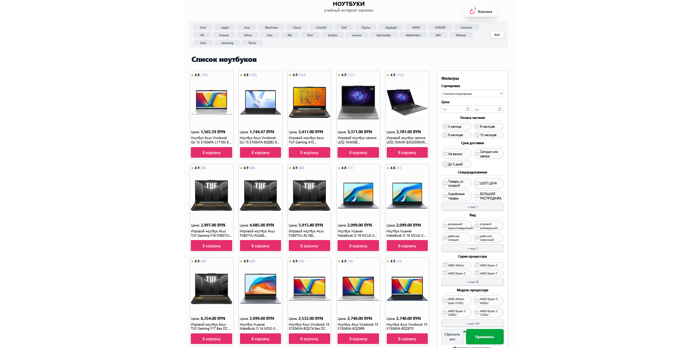
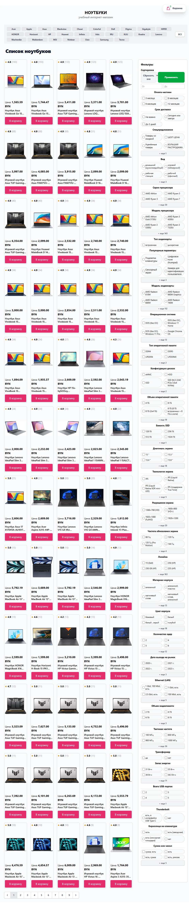
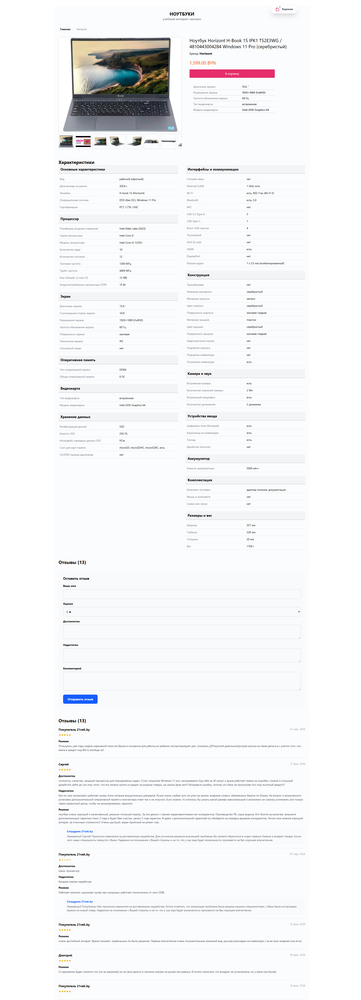
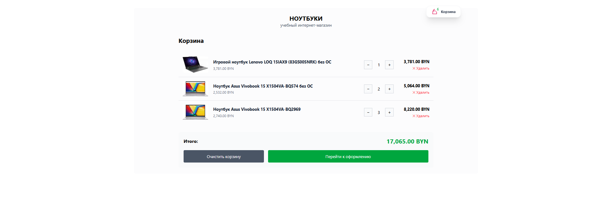

# 💻 Online laptop store

## 📖 Project Description

Notebooks Store is an educational online store for laptops, with data obtained via a parser from 21vek.by. The project demonstrates the creation of a full-featured catalog with filtering, pagination, a shopping cart, and an order form.

## 🚀 Main Functionality

### 🔄 Data Parsing

- **Pagination** — iterate through all catalog pages of laptops
- **Caching** — save HTML pages to the database for reuse
- **Information Extraction** — brand, name, SKU, price, rating, review count
- **Image Gallery** — collect photo links with preview replacement to full-size
- **Specifications** — grouping by sections (processor, memory, screen, etc.)

### 📝 Reviews

- **Review Collection** — from HTML and AJAX requests (21vek.by JSON API)
- **Review Pagination** — automatic loading via offset/limit
- **Review Structure** — name, rating, pros, cons, summary, store response

### 🛒 Online Store

- **Catalog** — product display with pagination
- **Filtering** — by brands and specifications (dynamic query building)
- **Sorting** — by price (cheap/expensive), popularity, rating
- **Shopping Cart** — Livewire components (add, change quantity, remove)
- **Checkout** — form with validation

### 🔄 Background Tasks

- **Review Count Update** — command to synchronize `reviews_count` for products

## 🛠️ Technology Stack

| Technology | Version | Purpose |
|------------|---------|---------|
| **PHP** | ^8.2 | Programming language |
| **Laravel** | ^12.0 | Main PHP framework |
| **Livewire** | ^4.1 | Reactive components (cart, filters) |
| **Symfony DomCrawler** | ^7.4 | HTML parsing / data extraction |
| **GuzzleHTTP** | (built-in) | HTTP requests with User-Agent and timeouts |
| **Tailwind CSS** | ^4.0 | Interface styling |
| **Vite** | ^7.0 | Frontend asset bundling |
| **MySQL / MariaDB** | 10.11+ | Relational database |
| **Redis** | 7.2+ | Cache and sessions (recommended) |
| **Docker** | - | Development environment containerization |

## 📦 Installation and Setup (Docker)

This is the recommended way to run the project. No local installation of PHP, Node.js, or MySQL is required.

### 1. Clone and Configure Environment

```bash
git clone https://github.com/KOSTYA0003/notebooksprxby.git
cd notebooksprxby
cp .env.example .env
```

*Make sure `.env` has Docker settings: `DB_HOST=laptop-db`, `DB_PASSWORD=root`, `DB_DATABASE=laptop_parser`.*

### 2. Build and Start Containers

```bash
docker-compose up -d --build
```

### 3. Configure Application Inside Container
```bash
docker exec -it laptop-app composer install
docker exec -it laptop-app php artisan key:generate
docker exec -it laptop-app php artisan storage:link
```

### 4. Build Frontend (Vite + Tailwind 4)
```bash
docker exec -it laptop-app npm install --force
docker exec -it laptop-app npm run build
```

### 5. Prepare Database
```bash
docker exec -it laptop-app php artisan migrate:fresh --seed
```

### 🌐 Access the Project:
- **Website:** [http://localhost:8084](http://localhost:8084)
- **Database (phpMyAdmin):** [http://localhost:8085](http://localhost:8085) 
  *(Server: laptop-db, Username: root, Password: root)*

## 🚀 Running the Parser

1. Collect product links (pagination)

```bash
docker exec -it laptop-app php artisan parse:21vek
```

2. Extract data and save to database

```bash
docker exec -it laptop-app php artisan app:extract-notebooks
```

3. Collect reviews

```bash
docker exec -it laptop-app php artisan app:parse-reviews
```

4. Update review counters

```bash
docker exec -it laptop-app php artisan app:update-reviews
```

## 📁 Key Commands Structure

| Command | Purpose |
|---------|------------|
| `parse:21vek` | Iterate pagination, collect product URLs, cache pages |
| `app:extract-notebooks` | Extract data from cache, save products, specifications, photos |
| `app:parse-reviews` | Collect reviews from HTML and JSON-API (with pagination) |
| `app:update-reviews` | Synchronize review count in products table |

### 🖼️  Interface / Screenshots

**Product Catalog**


**Dynamic Filters**


**Specifications and Reviews**


**Shopping Cart (Livewire)**


## 📄 License
MIT